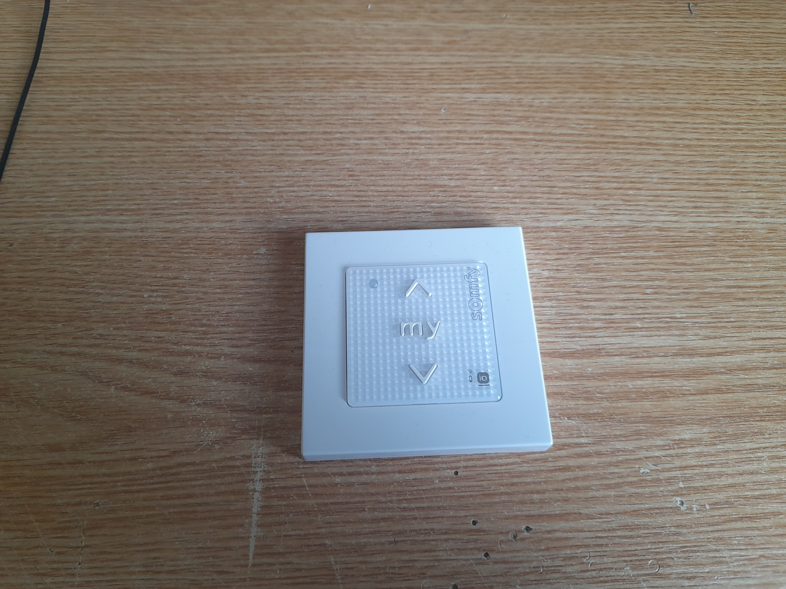

Description:
The goal of this project was to connect Somfy external blinds with HomeAssistant in a low cost fashion. It uses Vemos D1 mini with ESPHome software connected to storebought *Somfy smoove origin io* transmitter, in 3D printed case.  

Bill of materials:
Somfy smoove origin io.
Vemos D1 mini clone (or any other controller that can run ESPHome running on 3.3V)
3D printed case (currently only for D1)
5 pieces of wire

Quick guide:
Disassemble Somfy smoove origin io controller, extract the PCB. Flash the D1 with ESPHome with yaml config file. Connect the D1 into the PCB according to this diagram 
- A - D2 - Up
- B - D3 - Stop
- C - D4 - Bottom
- \- - Gnd
- \+ - 3.3V

Insert D1 into the case base, push transmitter into the lid. Put the lid on the base (it should be friction fit). Power it on, adopt in homeassistant, enjoy.

Motivation:
We have bought a new electric shutters for our window. The company with the best price and availability was using Somfy motors and controllers. I have my own homeassistant instance, and it would be very nice to be able to control the blinds from home assistant. I have read the internet far and wide, and there were some sources about controlling these blinds without proprietary cloud, hub and so on, (https://github.com/Velocet/iown-homecontrol, https://github.com/merbanan/rtl_433/issues/1376, https://github.com/Aldohrs/iown-homecontrol/blob/main/LinkLayer.md) but in the time of my purchase it seems to be not well developed yet. The company has tried to sell me one remote controll to control both blinds, but I have asked for 4 of the most basic controller (somfy smoove origin io), 2 for each blind. My plan at this point was to connect 3 rellay modules for each button to the controller to controll the buttons from ESP8266 through EspHome.

This is my Somfy smoove origin io:

First step was to disassemble the controller. We are after the middle green part, extracted here:

If you want to extract the PCB from this part, you need to void your warranty by digging into the label to find the 3rd screw. BTW the screws were T4, which is very small screw, and I would advise you to check your toolbox if you have proper bit before commiting to this project.

On these pictures, you can finally see the naked transmitter PCBs. The 3 middle golden circles are the switches.

On this picture, it is easy to spot the buttons. Having a good look at the board, I was able to determine the correct through holes, that connects to the switches (continuity measuring multimeter FTW). After marking the correct through holes (red on the outer part of the switch, black on the inner part), I have noticed that two of the red holes (on the right side) are connected. 

After continuity measuring some more, I verified that all 3 of those red through holes are connected directly to the + battery terminal! So I would not need any clunky relays to control it, a simple microcontroller could send 0 or 3V to the black through holes, and the transmitter would think button was pressed.
I have chosen Vemos D1 mini as controller, because I had a lot of them laying around, and it has 3V3 logic. We can even use it to power the transmitter.

As a software, I have chosen ESPHome. If you have not heard about ESPHome, I would highly recommend checking them out. You can use easy to read YAML files to "program" functionality, and it has out of the box connection to the HomeAssistant. I would suggest to program the D1 before connecting it to the transmitter. 
The soldering job was quite difficult (through holes are very small), but it did not take long to marry the transmitter and D1.

Then, the case. 3D printer to the rescue. Lid is friction fitted to the base, and it contains a little pun. I was quite angry at Somfy that they do not have any easy solution to connect the blinds to Wifi for Homeassistant to read. So I have named this box SomWifi, which means "I am Wifi" in my language. All puns sounds much better when you first think about them.

